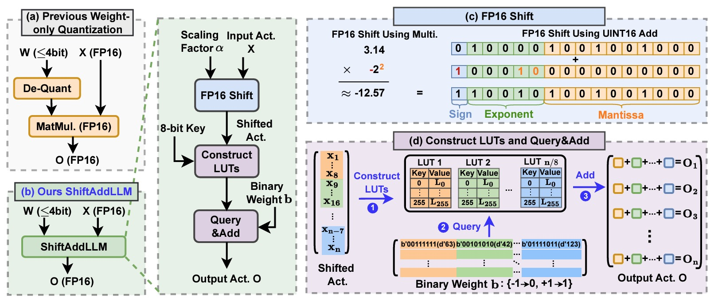

<p align="center">
  
</p>

### <div align="center">👉 ShiftAddLLM: Accelerating Pretrained LLMs via Post-Training Multiplication-Less Reparameterization<div> 

<div align="center">
  <a href="https://opensource.org/licenses/Apache-2.0"></a> &ensp;
  <a href="https://arxiv.org/abs/2406.05981"></a> &ensp;
  <a href="https://github.com/GATECH-EIC/ShiftAddLLM"></a> &ensp;
  <a href="https://huggingface.co/ShiftAddLLM"></a> &ensp;

  ---
  ***Your GPU-friendly multiplication-free LLMs without training or fine-tuning!***

  [**ShiftAddLLM: Accelerating Pretrained LLMs via Post-Training Multiplication-Less Reparameterization**](https://arxiv.org/abs/2406.05981)<br>
  [Haoran You](https://www.haoranyou.com/), 
  [Yipin Guo](https://openreview.net/profile?id=~Yipin_Guo1), 
  [Yichao Fu](https://github.com/Viol2000),
  [Wei Zhou](https://www.linkedin.com/in/wei-zhou3/),
  [Huihong Shi](https://scholar.google.com/citations?user=j7AChUYAAAAJ&hl),
  [Xiaofan Zhang](https://www.xiaofanzhang.net/), <br>
  [Souvik Kundu](https://ksouvik52.github.io/), 
  [Amir Yazdanbakhsh](https://www.ayazdan.com/), 
  [Yingyan Lin](https://eiclab.scs.gatech.edu/pages/team.html)
  <br>Georgia Institute of Technology, Intel Labs, Google, Google DeepMind<br>

</div>

---

## News 🔥🔥 !
- [ To Do ] Release model checkpoints.
- [ ✅ New ] Jun. 10, 2024. 💥 [ShiftAddLLM](https://arxiv.org/abs/2406.05981)'s PyTorch implementation codes are released!


## Table of Content

[Brief Introduction](#brief-introduction)

[Basic Usage](#basic-usage)
* [Environment Setup](#environment-setup)
* [Core Training Options](#core-training-options)

[Reproduce ShiftAddLLM](#reproduce-shiftaddllm)
* [ShiftAddLLM (Acc.)](#shiftaddllm-acc)
* [ShiftAddLLM (Lat.)](#shiftaddllm-lat)
* [Zero-Shot Tasks](#zero-shot-downstream-task-evaluation)

[Citation & Acknowledgement](#citation--acknowledgement)


## Brief Introduction

Large language models (LLMs) excel in language tasks but struggle on resource-constrained devices due to high memory demands and latency from dense multiplications. Shift-and-add reparameterization replaces costly multiplications with hardware-friendly operations in LLMs' attention and MLP layers, but current methods need training from scratch or fine-tuning. We propose ShiftAddLLM, which accelerates pretrained LLMs via post-training shift-and-add reparameterization. We quantize weight matrices into binary matrices and scaling factors, reparameterizing multiplications into shifts, adds, and look-up table queries. Our multi-objective optimization minimizes reparameterization errors, and an automated bit allocation strategy reduces memory usage and latency. Experiments on five LLM families and eight tasks consistently validate the effectiveness of ShiftAddLLM, achieving average perplexity improvements of 5.6 and 22.7 points at comparable or lower latency compared to the most competitive quantized LLMs at 3 and 2 bits, respectively, and more than 80\% memory and energy reductions over the original LLMs.

<p align="center">
    
</p>

To avoid fine-tuning after reparameterization, our ShiftAddLLM mimics the original LLM multiplications using Binary-Coding Quantization (BCQ) with customized CUDA kernels, eliminating the need for dequantization. As shown in the above figure, ShiftAddLLM quantizes pretrained weights into binary matrices $\mathbf{b}$ and powers of two scaling factors $\alpha$. During optimization, scaling factors are further quantized to powers of two. We replace weight-activation multiplications with bitwise shifts and LUT-based lookups, efficiently implemented on GPUs. This approach simplifies hardware operations, reducing redundant computations and enabling post-training quantization of all pretrained weights in LLMs.

To reduce accuracy loss, we present a multi-objective optimization method to minimize both weight and output activation reparameterization errors. Additionally, considering the varying sensitivity across layers to reparameterization, we develop an automated bit allocation strategy to further reduce memory usage and latency. More technical details can be found in our paper.

## Basic Usage
### Environment Setup
```
conda env create -f environment.yml
conda activate shiftaddllm
export PYTHONPATH='YOUR-PATH-TO-SHIFTADDLLM-REPO'
```

### Core Training Options
- `model`: huggingface path of the model to quantize.
- `dataset`: which dataset you want to use as calibration data.
- `wbits`: number of bits to use for quantization; use 16 for evaluating base model.
- `groupsize`: groupsize to use for quantization; default uses full row.
- `act-order`: whether to apply the activation order GPTQ heuristic.
- `bcq`: whether to quantize weights with binary coded quantization (bcq).
- `bcq_round`: steps to iterate bcq quantization.
- `columnwise`: whether to use columnwise - bcq - round to power of 2 - quantization to evaluate model.
- `block_quant` & `cust_group`: whether to use blockwise (8 column by 1/8 rows for 1 quantize param) - bcq - round to power of 2 - quantization to evaluate model. Need to use with 'columnwise' set.
- `use_bst`: whether to use binary search to get BinaryWeight.
- `apot_nums`: set nums shift weight for quantization.
- `acc`: whether to use Ours(acc.) to quantize the model.
- `lat`: whether to use Ours(lat.) to quantize the model. Only one of `acc` and `lat` should be set.

## Reproduce ShiftAddLLM
### ShiftAddLLM (Acc.)
To quantize LLMs using our ShiftAddLLM (Acc.) method with column-wise scaling factors and evaluate their performance, we provide scripts for five different LLM families.
- [OPT](script/acc/eval_opt.sh)
- [Llama2 & Llama3](script/acc/eval_llama.sh)
- [Bloom](script/acc/eval_bloom.sh)
- [Mistral](script/acc/eval_mistral.sh)
- [Gemma](script/acc/eval_gemma.sh)

### ShiftAddLLM (Lat.)
To quantize LLMs using our ShiftAddLLM (Lat.) method with block-wise scaling factors and evaluate their performance, we provide scripts for five different LLM families.
- [OPT](script/lat/eval_opt.sh)
- [Llama2 & Llama3](script/lat/eval_llama.sh)
- [Bloom](script/lat/eval_bloom.sh)
- [Mistral](script/lat/eval_mistral.sh)
- [Gemma](script/lat/eval_gemma.sh)

### Zero-Shot Downstream Task Evaluation
To evaluate quantized LLMs on seven downstream tasks for zero-shot task accuracy evaluation, run:
```
python3 main.py  <model_name> <calibration_dataset> --task <task_name> --num_fewshot <num_fewshot> 
```
 We also provide example scripts for two LLM families.
- [OPT](zeroShot/script/eval_opt.sh)
- [Llama2 & Llama3](zeroShot/script/eval_llama.sh)


## Citation & Acknowledgement

````
@article{you2024shiftaddllm,
  title={ShiftAddLLM: Accelerating Pretrained LLMs via Post-Training Multiplication-Less Reparameterization},
  author={You, Haoran and Guo, Yipin and Fu, Yichao and Zhou, Wei and Shi, Huihong and Zhang, Xiaofan and Kundu, Souvik and Yazdanbakhsh, Amir and Lin, Yingyan},
  journal={arXiv preprint arXiv:2406.05981},
  year={2024}
}
````

Thanks to [OPTQ](https://openreview.net/forum?id=tcbBPnfwxS), [LUT-GEMM](https://arxiv.org/abs/2206.09557), and [DeepShift](https://arxiv.org/abs/2208.09708) for their wonderful work and codebase!
